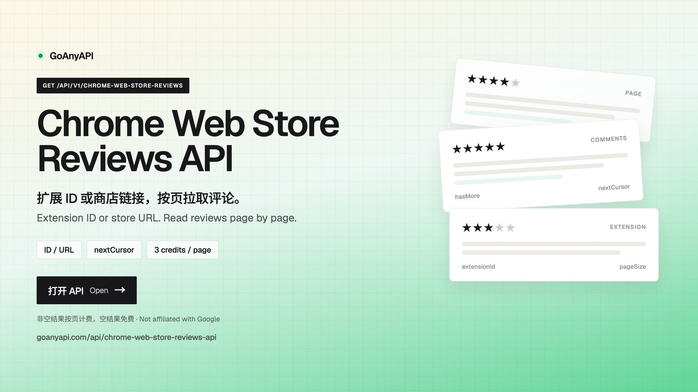
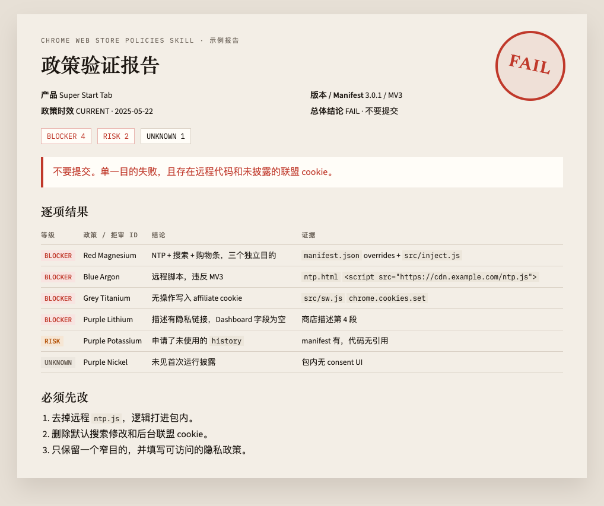
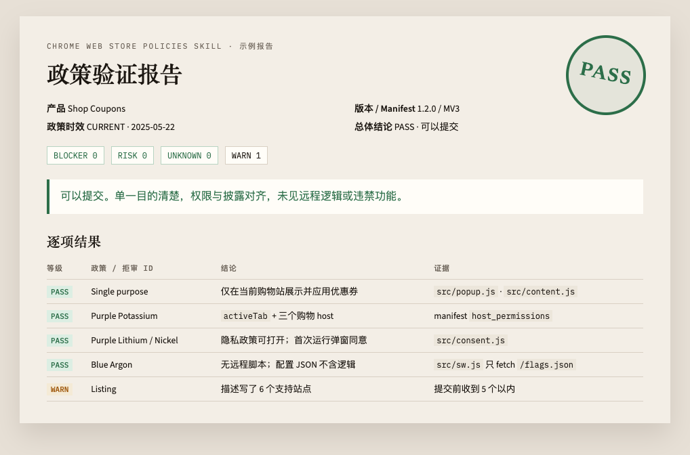

[中文](README.md) | **English**

# Chrome Web Store Policies Skill

An open-source Chrome Web Store policy review skill for Cursor, Claude Code, Codex, and similar agents. Use it for pre-submit reviews, rejection diagnosis, and privacy-field checks against the official [Program Policies](https://developer.chrome.com/docs/webstore/program-policies).

Policy single-page version: Last updated **2025-05-22**. The [official page](https://developer.chrome.com/docs/webstore/program-policies/policies) wins if anything conflicts. This repo checks official sources weekly; changes open a PR and never rewrite the skill text unattended.

Repo: https://github.com/shineforever/chrome-webstore-policies-skill  
License: [MIT](LICENSE) (official policy snapshots are excluded; see the end)  
Author: [Fantexi on X](https://x.com/fantexi997) — please follow there for updates

## Install

Use the [skills CLI](https://github.com/vercel-labs/skills) to install into the major agents.

### Cursor / Claude Code / Codex (recommended)

In the current project:

```bash
npx skills add shineforever/chrome-webstore-policies-skill --agent cursor --agent claude-code --agent codex
```

Install globally (all projects):

```bash
npx skills add shineforever/chrome-webstore-policies-skill -g --agent cursor --agent claude-code --agent codex
```

One agent only:

```bash
npx skills add shineforever/chrome-webstore-policies-skill --agent cursor
npx skills add shineforever/chrome-webstore-policies-skill --agent claude-code
npx skills add shineforever/chrome-webstore-policies-skill --agent codex
```

Restart the agent session after install. Mentions of CWS review, listing, rejection, or privacy fields should load this skill.

### Manual install

Clone, then copy the skill directory (it must contain `SKILL.md` plus the sibling reference files):

```bash
git clone https://github.com/shineforever/chrome-webstore-policies-skill.git
cd chrome-webstore-policies-skill
```

| Tool | Project (recommended) | Global |
|------|----------------------|--------|
| Cursor | `.cursor/skills/chrome-webstore-policy-review/` | `~/.cursor/skills/chrome-webstore-policy-review/` |
| Claude Code | `.claude/skills/chrome-webstore-policy-review/` | `~/.claude/skills/chrome-webstore-policy-review/` |
| Codex | `.agents/skills/chrome-webstore-policy-review/` | `~/.codex/skills/chrome-webstore-policy-review/` |

Project-level example:

```bash
# Cursor
mkdir -p /path/to/your-extension/.cursor/skills
cp -R .cursor/skills/chrome-webstore-policy-review \
  /path/to/your-extension/.cursor/skills/chrome-webstore-policy-review

# Claude Code
mkdir -p /path/to/your-extension/.claude/skills
cp -R .cursor/skills/chrome-webstore-policy-review \
  /path/to/your-extension/.claude/skills/chrome-webstore-policy-review

# Codex
mkdir -p /path/to/your-extension/.agents/skills
cp -R .cursor/skills/chrome-webstore-policy-review \
  /path/to/your-extension/.agents/skills/chrome-webstore-policy-review
```

Root `SKILL.md` matches `.cursor/skills/chrome-webstore-policy-review/`. Copy either tree. Reference docs must sit next to `SKILL.md`.

## How to use

In an extension project, ask the agent to:

- Pre-review this extension against Chrome Web Store policies
- Check whether this package can be submitted
- Explain a rejection such as `Purple Potassium`
- Draft the single-purpose field and each permission justification
- Cross-check the privacy policy, Dashboard disclosures, and code

Give the agent the **same package you will submit** (not only the source repo root). Chrome store packages are usually a build output, for example `.output/chrome-mv3/`.

You can run a static scan first. Findings are clues, **not** a verdict. With network access, the scan also checks this skill’s policy date against the official `Last updated`:

```bash
python3 scripts/scan.py /path/to/extension-package
python3 scripts/scan.py --skip-policy-check /path/to/extension-package
python3 scripts/check_policy_updates.py --freshness
```

The agent should follow [SKILL.md](SKILL.md) and print a report with an overall result, evidence, and fixes.

Materials to collect are listed in [SKILL.md](SKILL.md) under “开始前收集材料”. Missing materials should be `UNKNOWN`, not a pass.

## Review research

To read how similar extensions are rated before you submit, use the [Chrome Web Store Reviews API](https://goanyapi.com/api/chrome-web-store-reviews-api). Pass an extension ID or a store URL, then page through `comments` with `nextCursor` and `hasMore`. Non-empty pages are billed (3 credits per successful request with the current configuration). Empty responses are free.

GoAnyAPI is an independent service and is not affiliated with, endorsed by, or sponsored by Google.

<a href="https://goanyapi.com/api/chrome-web-store-reviews-api">

</a>

## What a review looks like

The skill writes the report in Chinese for the developer, and keeps official policy names / rejection IDs in English. These two images are sample reports from [examples.md](examples.md) (fictional products, not a real store listing).

**Do not submit (FAIL)** — any `BLOCKER` means stay out of the store.



**Ready to submit (PASS)** — no blockers; only a WARN to tighten before upload.



Full Markdown samples are in [examples.md](examples.md).

## How risk is judged

Grade each check, then roll up to an overall result. Full rules live in [SKILL.md](SKILL.md).

### Per-item grades

| Grade | Meaning | Can you submit? | Typical example |
|-------|---------|-----------------|-----------------|
| `BLOCKER` | Current policy would reject or delist | No | Remote logic, no privacy policy, permissions far too broad, policy/code/Dashboard mismatch |
| `RISK` | Likely bounce or longer review | Default no | Whether `<all_urls>` is needed, incomplete affiliate disclosure, automatic collection of the current site |
| `WARN` | Quality/discoverability, or soft evidence | Yes, with the risk named | Extra keywords, review prompts, categories Google will not feature |
| `PASS` | Compliance evidence was found | — | MV3 logic ships in the package; features match the listing |
| `N/A` | This item does not apply | — | Skip Chrome Apps rules when the target is not a Chrome App |
| `UNKNOWN` | Not enough materials | Treat as unfinished | Missing screenshots, 2SV, or an openable privacy-policy URL |

### Overall result

| Overall | How you get it | Advice |
|---------|----------------|--------|
| `FAIL` | Any `BLOCKER` | Do not submit |
| `CONDITIONAL` | No BLOCKER, but some `RISK` | Fix first by default; submit only if the developer accepts the risk |
| `PASS` | Only PASS / WARN / N/A | Can submit |
| `INCOMPLETE` | Privacy policy, remote code, single purpose, or permissions are `UNKNOWN` | Gather materials and review again |

Do not say “try submitting anyway” when a `BLOCKER` exists. A scan finding is not a violation; a clean scan is not approval.

## Which doc covers which risk

Follow [SKILL.md](SKILL.md). Open the matching reference after you know the risk.

| Problem | Common grade | Read first |
|---------|--------------|------------|
| How to review, how to write the report, can I submit | Overall `FAIL` / `CONDITIONAL` / `PASS` / `INCOMPLETE` | [SKILL.md](SKILL.md) |
| Remote scripts, `eval`, obfuscation, MV3 logic not in the package | `BLOCKER` (Blue Argon / Red Titanium) | [checklist.md](checklist.md) technical requirements; [rejection-ids.md](rejection-ids.md) |
| Too many permissions, `<all_urls>`, future-proofing | `BLOCKER` / `RISK` (Purple Potassium) | [privacy.md](privacy.md); [rejection-ids.md](rejection-ids.md) |
| Privacy policy missing, broken, or inconsistent with code | `BLOCKER` (Purple Lithium) | [privacy.md](privacy.md) |
| No in-product disclosure/consent; only the store description | `BLOCKER` (Purple Nickel) | [privacy.md](privacy.md) |
| User data over HTTP, or in a URL query | `BLOCKER` / `RISK` (Purple Copper) | [privacy.md](privacy.md); [rejection-ids.md](rejection-ids.md) |
| Browsing history, screenshots, email, third-party sharing | `BLOCKER` / `RISK` (Limited Use) | [privacy.md](privacy.md) |
| Single purpose too broad; bundled ads/search/NTP | `BLOCKER` / `RISK` (Red Magnesium, etc.) | [checklist.md](checklist.md) single purpose |
| Broken features, listing claims the extension cannot do, jump-only | `BLOCKER` (Yellow Magnesium / Lithium / Potassium) | [checklist.md](checklist.md); [rejection-ids.md](rejection-ids.md) |
| Listing missing icon/screenshots/description, keyword stuffing | `BLOCKER` / `WARN` (Yellow Zinc / Argon) | [checklist.md](checklist.md) listing quality |
| Affiliate links not disclosed, silent injection | `BLOCKER` / `RISK` (Grey Titanium) | [checklist.md](checklist.md) marketing |
| Deceptive install, misleading CTA | `BLOCKER` (Red Zinc) | [checklist.md](checklist.md); [rejection-ids.md](rejection-ids.md) |
| Email uses a color + element ID | Trust the official ID | [rejection-ids.md](rejection-ids.md) |
| What a pass/fail report looks like | — | [examples.md](examples.md) |
| Static package scan (missing files, remote script, plaintext HTTP) | Clues only | [scripts/scan.py](scripts/scan.py) |
| Are official policies newer than this skill | Report header `CURRENT` / `STALE` / `UNKNOWN` | [SKILL.md](SKILL.md) freshness; `python3 scripts/check_policy_updates.py --freshness` |

Official sources:

- [Policy index](https://developer.chrome.com/docs/webstore/program-policies)
- [Single-page policies](https://developer.chrome.com/docs/webstore/program-policies/policies)
- [Troubleshooting](https://developer.chrome.com/docs/webstore/troubleshooting)
- [Privacy fields](https://developer.chrome.com/docs/webstore/cws-dashboard-privacy)

## How policies stay current

Every Monday, GitHub Actions fetches official `.md.txt` snapshots (single-page policies, troubleshooting, privacy fields, related FAQs) and diffs them against [`sources/`](sources/):

- No diff: nothing is committed
- Diff: snapshots are updated and a PR is opened on `chore/policy-watch`
- **No unattended edits** to `SKILL.md` / `checklist.md`. A human reads the diff, updates the checklists, and bumps `skill_version`

Maintainers can also run **Policy watch** manually in Actions.

When you run a local review or `scan.py`, the agent/script will:

1. Read this skill’s `sources/manifest.json` (`policy_last_updated`, `skill_version`)
2. Read the official `Last updated`
3. Compare `skill_version` on GitHub

If the official date or the published skill version is newer, the report tells you to update with:

```bash
npx skills add shineforever/chrome-webstore-policies-skill --agent cursor --agent claude-code --agent codex
```

GitHub Actions **cannot** write into your local Cursor / Claude / Codex skill folders.

Offline, mark freshness `UNKNOWN` and keep using the local checklist.

## Scope

Use this only to review your own product. It does not help circumvent review, disguise features, or bypass enforcement.

## License

Skill docs, scripts, GitHub Actions, and checklists are under the [MIT License](LICENSE).

Files in [`sources/snapshots/`](sources/snapshots/) come from [Chrome for Developers](https://developer.chrome.com/docs/webstore/program-policies/policies). Copyright remains with Google and its affiliates and is **not** covered by MIT. Snapshots exist only to detect official changes. The live pages take precedence. See [`sources/NOTICE`](sources/NOTICE).

## Author

Maintained by [Fantexi](https://x.com/fantexi997). Follow [@fantexi997](https://x.com/fantexi997) on X for updates.
