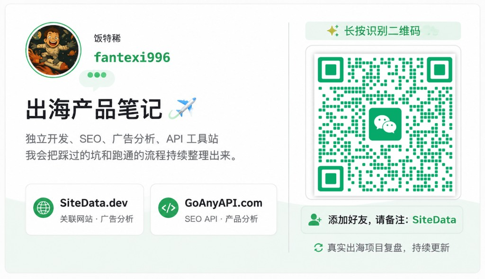

**中文** | [English](README.en.md)

# Chrome Web Store Policies Skill

开源的 Chrome Web Store 政策验证 Skill。给 Cursor、Claude Code、Codex 等 Agent 用，对照 [Program Policies](https://developer.chrome.com/docs/webstore/program-policies) 做上架前预审、拒审诊断和隐私字段核对。

政策单页版本：Last updated **2025-05-22**。以 [官方单页](https://developer.chrome.com/docs/webstore/program-policies/policies) 为准。本仓库每周核对一次官方来源；有变化会开 PR，不会在无人审核的情况下改 Skill 正文。

仓库：https://github.com/shineforever/chrome-webstore-policies-skill  
许可：[MIT](LICENSE)（不含官方政策快照，见文末）  
作者：饭特稀 · [X/Twitter](https://x.com/fantexi997) · 微信 / 公众号见 [文末](#作者)

## 安装

推荐用 [skills CLI](https://github.com/vercel-labs/skills)，一次装到主流 Agent。

### Cursor / Claude Code / Codex（推荐）

当前项目里：

```bash
npx skills add shineforever/chrome-webstore-policies-skill --agent cursor --agent claude-code --agent codex
```

装到本机全局（所有项目可用）：

```bash
npx skills add shineforever/chrome-webstore-policies-skill -g --agent cursor --agent claude-code --agent codex
```

只装某一个：

```bash
npx skills add shineforever/chrome-webstore-policies-skill --agent cursor
npx skills add shineforever/chrome-webstore-policies-skill --agent claude-code
npx skills add shineforever/chrome-webstore-policies-skill --agent codex
```

安装后重启 Agent 会话。之后提到 CWS 审核、上架、拒审、隐私字段时，Agent 应自动加载本 skill。

### 手动安装

先 clone，再按工具复制 skill 目录（目录里必须有 `SKILL.md` 及同级参考文档）：

```bash
git clone https://github.com/shineforever/chrome-webstore-policies-skill.git
cd chrome-webstore-policies-skill
```

| 工具 | 项目级（推荐） | 全局 |
|------|----------------|------|
| Cursor | `.cursor/skills/chrome-webstore-policy-review/` | `~/.cursor/skills/chrome-webstore-policy-review/` |
| Claude Code | `.claude/skills/chrome-webstore-policy-review/` | `~/.claude/skills/chrome-webstore-policy-review/` |
| Codex | `.agents/skills/chrome-webstore-policy-review/` | `~/.codex/skills/chrome-webstore-policy-review/` |

项目级示例：

```bash
# Cursor
mkdir -p /path/to/your-extension/.cursor/skills
cp -R .cursor/skills/chrome-webstore-policy-review \
  /path/to/your-extension/.cursor/skills/chrome-webstore-policy-review

# Claude Code
mkdir -p /path/to/your-extension/.claude/skills
cp -R .cursor/skills/chrome-webstore-policy-review \
  /path/to/your-extension/.claude/skills/chrome-webstore-policy-review

# Codex
mkdir -p /path/to/your-extension/.agents/skills
cp -R .cursor/skills/chrome-webstore-policy-review \
  /path/to/your-extension/.agents/skills/chrome-webstore-policy-review
```

本仓库根目录的 `SKILL.md` 与 `.cursor/skills/chrome-webstore-policy-review/` 内容相同，复制任一处即可。参考文档必须和 `SKILL.md` 放在同一层。

## 怎么使用

在扩展项目里对 Agent 说：

- 按 Chrome Web Store 政策预审这个扩展
- 用 Chrome Web Store Policies Skill 检查能不能提交
- 邮件里是 `Purple Potassium`，帮我看怎么改
- 帮我写单一目的字段和每个权限的 justification
- 核对隐私政策、Dashboard 勾选和代码是否一致

请提供将要提交的 **同一份包**（不要只给源码仓库根目录）。Chrome 上架包一般是构建产物，例如 `.output/chrome-mv3/`。

本地可先跑静态扫描。扫描只标可疑点，**不是**最终结论。有网时扫描开头会核对本 skill 的政策日期和官方 `Last updated`：

```bash
python3 scripts/scan.py /path/to/extension-package
python3 scripts/scan.py --skip-policy-check /path/to/extension-package
python3 scripts/check_policy_updates.py --freshness
```

Agent 应按 [SKILL.md](SKILL.md) 输出验证报告，包含总体结论、逐项证据和修复建议。

需要准备的材料见 [SKILL.md](SKILL.md)「开始前收集材料」。缺材料应标 `UNKNOWN`，不要当成通过。

## 风险如何判断

先给每条检查一个等级，再汇总成总体结论。完整规则在 [SKILL.md](SKILL.md)。

### 单条等级

| 等级 | 含义 | 能不能提交 | 典型例子 |
|------|------|------------|----------|
| `BLOCKER` | 按现行政策会拒审或下架 | 否 | 远程执行逻辑、无隐私政策、权限明显过宽、政策/代码/Dashboard 不一致 |
| `RISK` | 高概率被打回或加长审核 | 默认否 | `<all_urls>` 是否必要、联盟披露不全、自动采集当前站点 |
| `WARN` | 质量/曝光问题，或证据偏软 | 可以，但要写明风险 | 关键词略多、评价提醒、不会被官方推荐的品类 |
| `PASS` | 已看到合规证据 | — | MV3 逻辑在包内、功能与描述一致 |
| `N/A` | 该条不适用 | — | 不是 Chrome App 就不查 Apps 条款 |
| `UNKNOWN` | 缺材料，无法判定 | 当作没查完 | 没看到商店截图、没看到 2SV、没打开隐私政策 URL |

### 总体结论

| 总体结论 | 怎么得出 | 建议 |
|----------|----------|------|
| `FAIL` | 有任一 `BLOCKER` | 不要提交 |
| `CONDITIONAL` | 无 BLOCKER，但有 `RISK` | 默认先改；用户知情后才可交 |
| `PASS` | 只有 PASS / WARN / N/A | 可以提交 |
| `INCOMPLETE` | 隐私政策、远程代码、单一目的、权限等关键项是 `UNKNOWN` | 补材料后再审 |

有 `BLOCKER` 时不要说「可以试试上架」。扫描发现不等于违规，无发现也不等于通过。

## 风险对应哪份文档

读 [SKILL.md](SKILL.md) 走流程。对上具体风险后再打开对应文档。

| 你遇到的问题 | 风险等级常见值 | 先读 |
|--------------|----------------|------|
| 怎么审、报告怎么写、能不能提交 | 总体 `FAIL` / `CONDITIONAL` / `PASS` / `INCOMPLETE` | [SKILL.md](SKILL.md) |
| 远程脚本、`eval`、混淆、MV3 逻辑不在包内 | `BLOCKER`（Blue Argon / Red Titanium） | [checklist.md](checklist.md) 技术要求；[rejection-ids.md](rejection-ids.md) |
| 权限过多、`<all_urls>`、future-proof | `BLOCKER` / `RISK`（Purple Potassium） | [privacy.md](privacy.md)；[rejection-ids.md](rejection-ids.md) |
| 隐私政策缺失、打不开、和代码不一致 | `BLOCKER`（Purple Lithium） | [privacy.md](privacy.md) |
| 没有产品内披露/同意，只写在商店描述里 | `BLOCKER`（Purple Nickel） | [privacy.md](privacy.md) |
| 用户数据走 HTTP，或放进 URL query | `BLOCKER` / `RISK`（Purple Copper） | [privacy.md](privacy.md)；[rejection-ids.md](rejection-ids.md) |
| 浏览记录、截图、邮箱、第三方共享 | `BLOCKER` / `RISK`（Limited Use） | [privacy.md](privacy.md) |
| 单一目的不窄、捆绑广告/搜索/NTP | `BLOCKER` / `RISK`（Red Magnesium 等） | [checklist.md](checklist.md) 单一目的 |
| 功能坏了、描述做不到、只有跳转 | `BLOCKER`（Yellow Magnesium / Lithium / Potassium） | [checklist.md](checklist.md)；[rejection-ids.md](rejection-ids.md) |
| 商店缺图标/截图/描述，关键词堆砌 | `BLOCKER` / `WARN`（Yellow Zinc / Argon） | [checklist.md](checklist.md) 上架信息 |
| 联盟链接未披露、后台静默插入 | `BLOCKER` / `RISK`（Grey Titanium） | [checklist.md](checklist.md) 营销与变现 |
| 欺骗安装、误导 CTA | `BLOCKER`（Red Zinc） | [checklist.md](checklist.md)；[rejection-ids.md](rejection-ids.md) |
| 邮件里是颜色+元素编号 | 以官方编号为准 | [rejection-ids.md](rejection-ids.md) |
| 想看合格/不合格报告长什么样 | — | [examples.md](examples.md) |
| 静态扫包（缺文件、远程 script、明文 HTTP） | 仅线索，不是结论 | [scripts/scan.py](scripts/scan.py) |
| 官方政策是否比本 skill 新 | 报告头 `CURRENT` / `STALE` / `UNKNOWN` | [SKILL.md](SKILL.md) 政策时效；`python3 scripts/check_policy_updates.py --freshness` |

官方原文：

- [政策目录](https://developer.chrome.com/docs/webstore/program-policies)
- [单页全文](https://developer.chrome.com/docs/webstore/program-policies/policies)
- [拒审对照](https://developer.chrome.com/docs/webstore/troubleshooting)
- [隐私字段](https://developer.chrome.com/docs/webstore/cws-dashboard-privacy)

## 政策如何保持更新

GitHub Actions 每周一拉取官方 `.md.txt` 快照（政策单页、拒审对照、隐私字段、相关 FAQ），和仓库里的 [`sources/`](sources/) 比较：

- 没 diff：什么也不提交
- 有 diff：更新快照并打开 PR（分支 `chore/policy-watch`）
- **不自动改** `SKILL.md` / `checklist.md`。合并前要人看 diff，再改清单、bump `skill_version`

维护者也可以在 Actions 里手动跑 `Policy watch`。

本地跑预审或 `scan.py` 时，Agent / 脚本会：

1. 读本 skill 的 `sources/manifest.json`（`policy_last_updated`、`skill_version`）
2. 取官方单页的 `Last updated`
3. 再对比 GitHub 上的 `skill_version`

官方日期更新，或仓库里的 skill 版本更新，会在报告顶部提示用下面命令更新。GitHub Actions **不能**写进你电脑上的 Cursor/Claude/Codex skill 目录。

```bash
npx skills add shineforever/chrome-webstore-policies-skill --agent cursor --agent claude-code --agent codex
```

没网则标 `UNKNOWN`，继续用本地清单。

## 范围

只用于开发者对自己产品的合规检查。不提供规避审核、伪装功能或绕过执行措施的做法。

## 许可

Skill 文档、脚本、GitHub Actions 和检查清单使用 [MIT License](LICENSE)。

[`sources/snapshots/`](sources/snapshots/) 来自 [Chrome for Developers](https://developer.chrome.com/docs/webstore/program-policies/policies) 官方文档，版权归 Google 及其关联方，**不在 MIT 授权范围内**。收录只为对照官方变更，使用以官方页面为准。说明见 [`sources/NOTICE`](sources/NOTICE)。

## 作者

独立开发者 [饭特稀](https://x.com/fantexi997)，写出海产品笔记。欢迎通过下面三个渠道交流。

### X / Twitter

[@fantexi997](https://x.com/fantexi997)

### 个人微信

微信号 `fantexi1996`，添加时请备注 **SiteData**。



### 公众号

微信扫码关注公众号。


